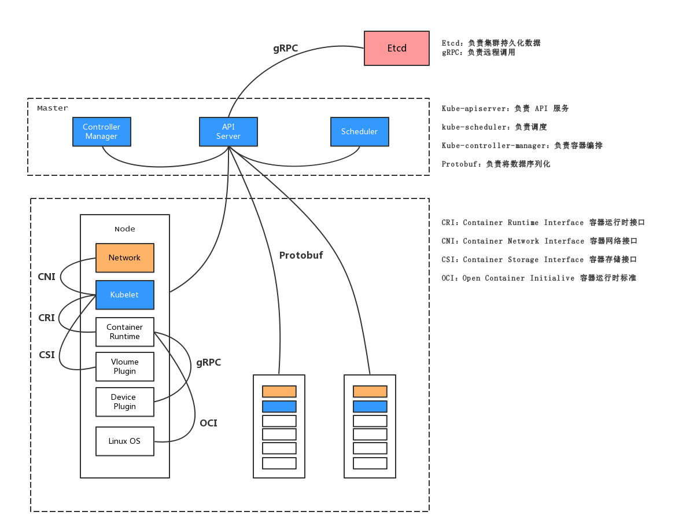

# 编排其实很简单：谈谈“控制器”模型


## 目录

- [实践环境](#实践环境)

- [实践一：通过 Deployment 对象初步了解「控制器」模型](#实践一)

- [总结](#总结)

---


## 实践环境

| 系统及软件 | 版本 |
| :--- | :--- |
| CentOS | 7.6.1810 |
| Kernel | 4.18.9-1.el7.elrepo.x86_64 |
| Kubernetes | 1.11.3 |
| Docker CE | 18.09.0 |

本次实践需要提前搭建好 Kubernetes 集群。

---


## 实践一

通过 Deployment 对象初步了解「控制器」模型。

### 创建 Deployment

1. 编写 nginx-deployment.yaml 文件
   
   [nginx-deployment.yaml](./nginx-deployment.yaml) 文件内容如下：

   ```yaml
   apiVersion: apps/v1
   kind: Deployment
   metadata:
     name: nginx-deployment
     labels:
       app: nginx
   spec:
     replicas: 2
     selector:
       matchLabels:
         app: nginx
     template:
       metadata:
         labels:
           app: nginx
       spec:
         containers:
         - name: nginx
           image: nginx:1.7.9
           ports:
             - containerPort: 80
   ```

   这个 Deployment 定义的编排动作非常简单，即：确保携带了 app=nginx 标签的 Pod 的个数永远等于 spec.replicas 指定的个数。

   这意味着，在这个集群中，携带 app=nginx 标签的 Pod 的个数大于 2 的时候，就会有旧的 Pod 会被删除；反之，就会有新的 Pod 会被创建。

2. 创建 Deployment

   ```bash
   $ kubectl create -f nginx-deployment.yaml
   deployment.apps/nginx-deployment created

   $ kubectl get deployment -l app=nginx
   NAME               DESIRED   CURRENT   UP-TO-DATE   AVAILABLE   AGE
   nginx-deployment   2         2         2            0           38s

   $ kubectl get pods -l app=nginx
   NAME                                READY     STATUS    RESTARTS   AGE
   nginx-deployment-7fc9b7bd96-gr7jc   1/1       Running   0          1m
   nginx-deployment-7fc9b7bd96-jn9mc   1/1       Running   0          1m
   ```

### 探索 Kubernetes 控制器

回顾一下 Kubernetes 组件架构：



由上图可知负责容器编排的组件为 Kube-controller-manager 的组件。

实际上，这个组件就是一系列控制器的集合。

查看一下 Kubernetes 项目的 pkg/controller 目录：

```bash
# 克隆 Kubernetes 库
$ git clone https://github.com/kubernetes/kubernetes.git

$ cd kubernetes/pkg/
$ ls -d */
api/   capabilities/   controller/          fieldpath/      kubectl/   master/    proxy/     routes/     securitycontext/  util/     watch/
apis/  client/         credentialprovider/  generated/      kubelet/   printers/  quota/     scheduler/  serviceaccount/   version/  windows/
auth/  cloudprovider/  features/            kubeapiserver/  kubemark/  probe/     registry/  security/   ssh/              volume/
```

这个目录下面的每一个控制器，都以独有的方式负责某种编排功能。刚才创建的 Deployment 就是这些控制器的其中一种。

实际上，这些控制器之所以被统一放在 pkg/controller 目录下，是因为它们都遵循 Kubernetes 项目中的一个通用编排模式，即：控制循环（control loop）。

比如现在有一种待编排的对象 X，它有一个对应的控制器。控制循环的流程如下：

```go
for {
   实际状态 := 获取集群中对象 X 的实际状态（Actual State）
   期望状态 := 获取集群中对象 X 的期望状态（Desired State）

   if 实际状态 == 期望状态 {
      什么都不做
   } else {
      执行编排动作，将实际状态调整为期望状态
   }
}
```

- **实际状态往往来自于 Kubernetes 集群本身。**<br/>
  比如，kubelet 通过心跳汇报的容器状态和节点状态，或者监控系统中保存的应用监控数据，或者控制器主动收集的它自己感兴趣的信息，这些都是常见的实际状态的来源。

- **期望状态一般来源于用户提交的 Yaml 文件。**<br/>
  比如，Deployment 对象中 Replicas 字段的值。这些信息往往保存在 Etcd 中。


### 观察控制器模型的实现

1. 获取 Etcd 中 Deployment 的实际状态

   统计 Pod 的个数。

   ```bash
   # 方式一：使用 etcdctl 命令查询 Etcd 中保存的数据
   $ ETCDCTL_API=3 etcdctl get /registry/pods --prefix -w json | python -m json.tool | grep key | awk -F\" '{print $(NF-1) }' | \
   > awk 'BEGIN{FS="\n";}  {cmd=sprintf("echo -n %s|base64 -d", $1);  system(cmd);  print "";}' |grep nginx-deployment
   /registry/pods/default/nginx-deployment-7fc9b7bd96-gr7jc
   /registry/pods/default/nginx-deployment-7fc9b7bd96-ldxkl

   # 方式二：调用 Kubernetes API 查询 Etcd 中保存的数据
   # 首先开启反向代理
   $ kubectl proxy --port=8080 &
   # 调用 Kubernetes API
   $ curl -s http://localhost:8080/api/v1/namespaces/default/pods?labelSeclector=app%3Dnginx | jq '{name:.items[].metadata.name}'
   {
     "name": "nginx-deployment-7fc9b7bd96-gr7jc"
   }
   {
     "name": "nginx-deployment-7fc9b7bd96-ldxkl"
   }
   ```

2. 获取 Etcd 中 Deployment 的期望状态

   查找 Deployment 对象中的 replicas 字段。

   ```bash
   # 方式一：使用 etcdctl 命令查询 Etcd 中保存的数据
   $ ETCDCTL_API=3 etcdctl get /registry/deployments/default/nginx-deployment --prefix -w json | jq . | awk -F\" '/value/{print $(NF-1)}' | base64 -d
   # 解析出来有乱码，暂时不知道原因，但是可以发现有一下信息：
   ..."spec":{"replicas":2,"selector":{"matchLabels":{"app":"nginx"}...

   # 方式二：使用 curl 调取 Kubernetes 接口查询 Etcd 中保存的数据
   # 首先开启反向代理
   $ kubectl proxy --port=8080 &
   # 调用 Kubernetes API
   $ curl -s http://localhost:8080/apis/extensions/v1beta1/namespaces/default/deployments/nginx-deployment | jq '.spec.replicas'
   2

   # 方式三：使用 kubectl 命令调取 Kubernetes 接口查询 Etcd 中保存的数据
   $ kubectl get --raw '/apis/extensions/v1beta1/namespaces/default/deployments/nginx-deployment' | jq '.spec.replicas'
   2
   ```

可以发现实际状态与期望状态是相等的。如果更新了期望状态即更新了 Deployment 对象中的 replicas 的值，那么实际状态也会通过控制循环进行删除或者增加 Pod。

以 Deployment 为例，简单描述一下它对控制器模型的实现：

1. Deployment 控制器从 Etcd 中获取到所有携带了「app:nginx」标签的 Pod，然后统计它们的数量，这就是实际状态；

2. Deployment 对象的 replicas 字段的值就是期望状态；

3. Deployment 控制器将两个状态做比较，然后根据比较结果，确定是创建 Pod，还是删除已有的 Pod。

实际上，Kubernetes 对象的主要编排逻辑，实际上市在第三部的「对比」阶段完成的。这个操作，通常叫作调谐（Reconcile）。这个调谐的过程，则被称作「Reconcile Loop」（调谐循环）或者「Sync Loop」（同步循环）。

---

## 总结

1. 类似 Deployment 这样的一个控制器，实际上是由上半部分的控制器定义（包括期望状态），加上下半部分的被控制对象的模板组成的。

   

2. Kubernetes 还有很多不同类型的容器编排功能，比如 StatefulSet、DaemonSet 等。它们无一例外地都有这样一个甚至多个控制器的存在，并遵循控制循环（Control Loop）的流程，完成各自的编排逻辑。 

3. 与 Deployment 相似，这些控制循环最后的执行结果，要么就是创建、更新一些 Pod（或者其他的 API 对象、资源），要么就是删除一些已经存在的 Pod（或者其他的 API 对象、资源）。也正是在这个统一的编排框架下，不同的控制器可以在具体的执行过程中，设计不同的业务逻辑，从而达到不同的编排效果。